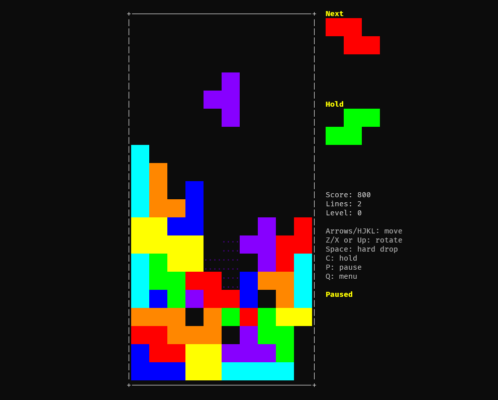

# TetrUI

Terminal-based falling-blocks tribute game with a focused TUI, local and synced scores, themes, and music.

> This project is **not related to Tetris**. It is a grand tribute to the original game.



## Demo


## Install

### Quick install (curl)

```bash
curl -fsSL https://raw.githubusercontent.com/KaiqueGovani/tetrui/master/install.sh | bash
```

### Windows (PowerShell)

```powershell
iex (iwr "https://raw.githubusercontent.com/KaiqueGovani/tetrui/master/install.ps1")
```

### Local build

```bash
go build -o tetrui
./tetrui
```

## Controls

- Move: Arrow keys / H J K L
- Rotate: Up or X (clockwise), Z (counterclockwise)
- Hard drop: Space
- Hold: C
- Pause: P
- Menu: Q or Esc
- Zoom: Ctrl++ / Ctrl+-

## Features

- Main menu, theme selection, config panel
- Local scores + optional sync (n8n webhook)
- Music loop in menu and full loop during gameplay
- Resize-safe layout for small terminals

## Built With

- [Bubble Tea](https://github.com/charmbracelet/bubbletea) - terminal UI framework
- [Lip Gloss](https://github.com/charmbracelet/lipgloss) - terminal styling
- [oto](https://github.com/ebitengine/oto) - low-level audio output
- [go-mp3](https://github.com/llehouerou/go-mp3) - MP3 decoding

## Music Credits

Music by <a href="https://pixabay.com/users/gregorquendel-19912121/?utm_source=link-attribution&utm_medium=referral&utm_campaign=music&utm_content=185592">Gregor Quendel</a> from <a href="https://pixabay.com/music//?utm_source=link-attribution&utm_medium=referral&utm_campaign=music&utm_content=185592">Pixabay</a>
